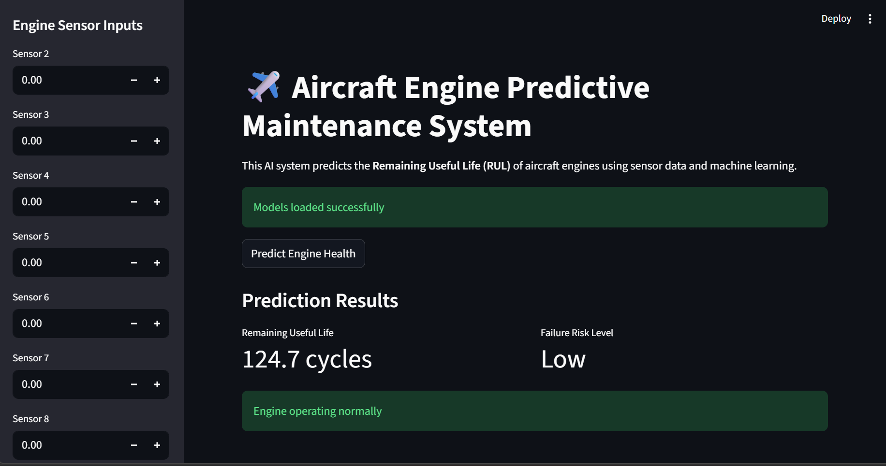
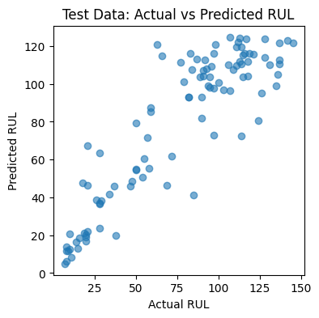

# ✈️ Aircraft Engine Predictive Maintenance System

An AI-driven predictive maintenance system that estimates the **Remaining Useful Life (RUL)** of aircraft engines using time-series sensor data.

## 🚀 Features

* Time-series feature engineering (rolling mean, std, delta)
* Random Forest regression model for RUL prediction
* Failure risk classification (Low / Medium / High)
* Explainable AI using SHAP
* Interactive Streamlit dashboard

---

## 🧠 Machine Learning Pipeline

1. Data preprocessing
2. Feature engineering
3. Model training
4. Model evaluation
5. Explainable AI (SHAP)
6. Interactive deployment with Streamlit

---

## 📊 Model Performance

| Metric | Value        |
| ------ | ------------ |
| MAE    | ~13.7 cycles |
| RMSE   | ~18.8 cycles |

---

## 🖥 Dashboard

### Main Interface



### Prediction Output



---

## ⚙️ Tech Stack

* Python
* Pandas
* Scikit-learn
* SHAP
* Streamlit

---

## ▶️ Run Locally

Clone the repository

```bash
git clone https://github.com/YOUR_USERNAME/aircraft-engine-predictive-maintenance.git
cd aircraft-engine-predictive-maintenance
```

Install dependencies

```bash
pip install -r requirements.txt
```

Run the dashboard

```bash
streamlit run app/dashboard.py
```

---

## 📁 Project Structure

```
Predictive-Maintenance-System
│
├── app
│   └── dashboard.py
│
├── models
│   ├── rul_model.pkl
│   └── risk_model.pkl
│
├── notebooks
│   ├── 01_data_preprocessing.ipynb
│   ├── 02_feature_engineering_model_training.ipynb
│   └── 03_test_evaluation.ipynb
│
├── src
│   └── feature_engineering.py
│
├── images
│
├── requirements.txt
└── README.md
```

---

## 📌 Future Improvements

* Real-time sensor streaming
* LSTM-based time series model
* Cloud deployment
